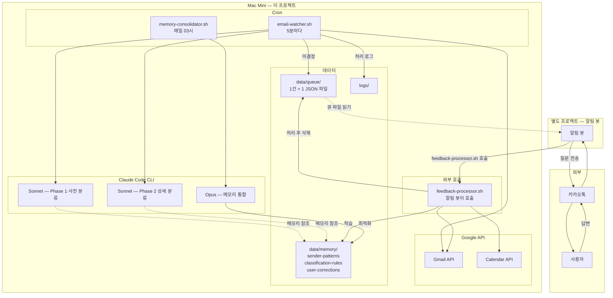
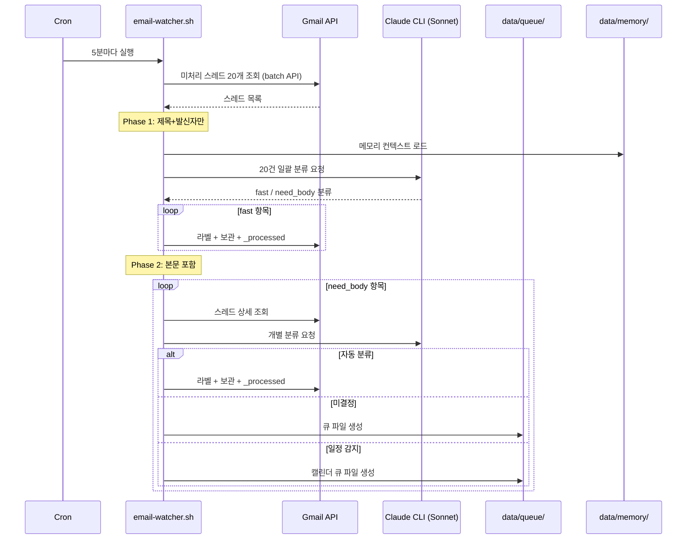
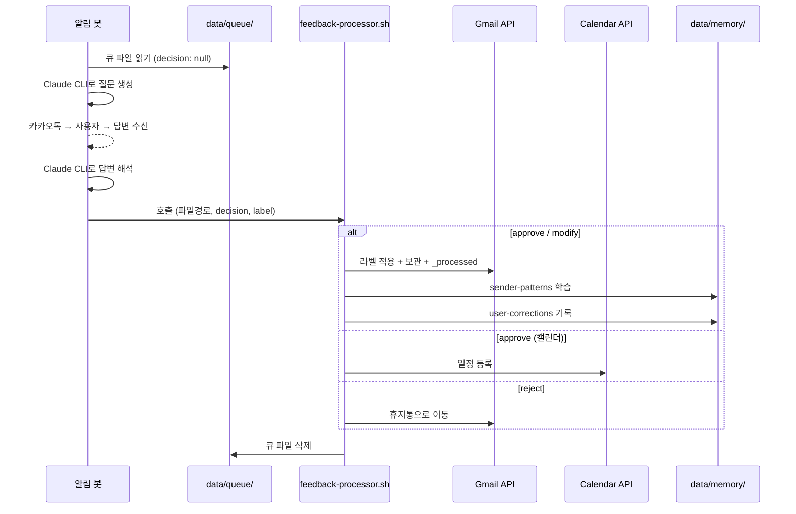
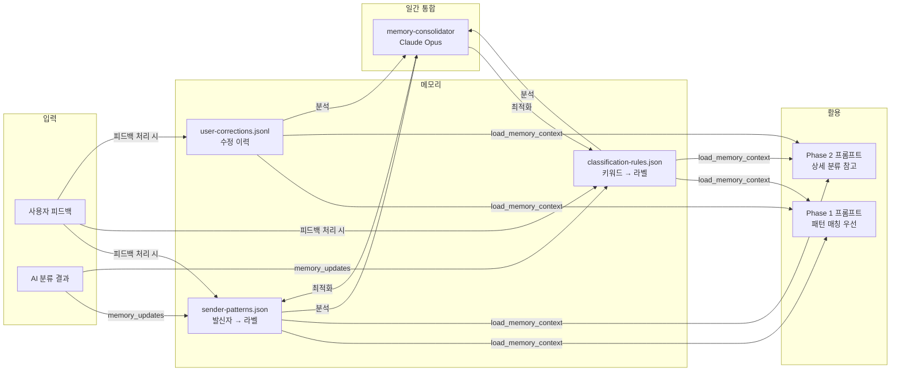

# 시스템 아키텍처

## 개요

Mac Mini에서 crontab으로 구동하는 이메일 자동 분류 + 캘린더 일정 등록 시스템.
Google API 직접 호출 + Claude Code CLI 기반.

## 전체 구성도



## 메일 분류 흐름



## 피드백 처리 흐름



## 메모리 학습 구조



## 스레드 단위 처리

- Gmail API `threads().list()`로 스레드 검색 (batch API로 메타데이터 일괄 조회)
- 스레드의 모든 메시지(보낸/받은)를 한 번에 그룹핑
- `_processed` 라벨은 스레드 단위 적용 → 중복 처리 방지 (멱등)
- Phase 2에서 스레드 전체 대화를 Claude에 전달 → 답장 내용까지 분석

## 큐 시스템 설계

파일 기반 메시지 큐. DB/API 불필요.

```
data/queue/
├── classifications/    분류 미결정 (pending-{id}.json)
├── calendars/          캘린더 미결정 (cal-{id}.json)
└── labels/             라벨 제안 (label-{name}.json)
```

- **1건 = 1 JSON 파일** → 동시 접근 충돌 없음
- **watcher**: 새 파일 생성만 (write)
- **알림 봇**: 파일 읽기만 (read)
- **feedback-processor**: 처리 후 삭제 (read → execute → delete)
- 파일 존재 = 미처리, 파일 없음 = 처리 완료

## 성능 최적화

| 병목 | 해결 |
| --- | --- |
| 스레드 검색 N+1 | Gmail batch API로 1회 호출 |
| 라벨 적용 건별 subprocess | Google API 클라이언트 1회 초기화 |
| Phase 2 과다 호출 | Phase 1에서 메모리 기반 fast 처리 비율 높임 |
| 메모리 무한 증가 | 매일 Opus 통합으로 정리 |
